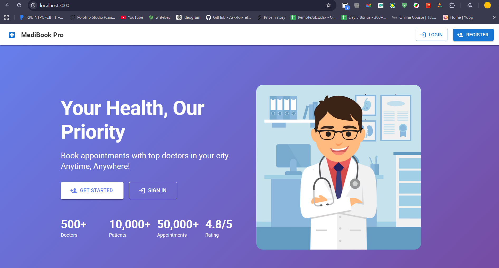
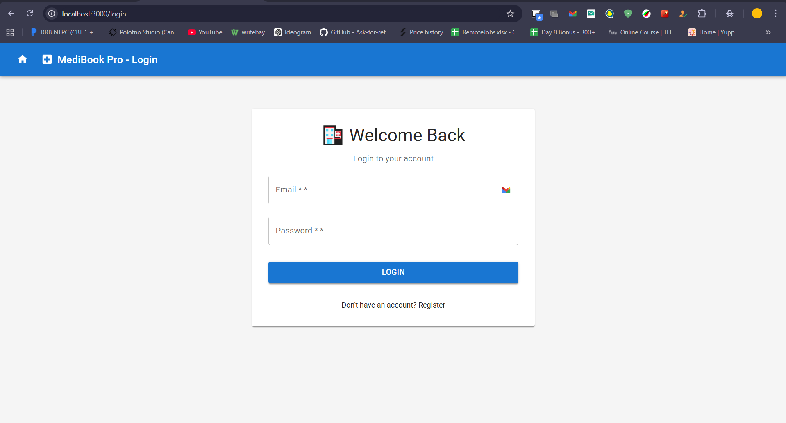
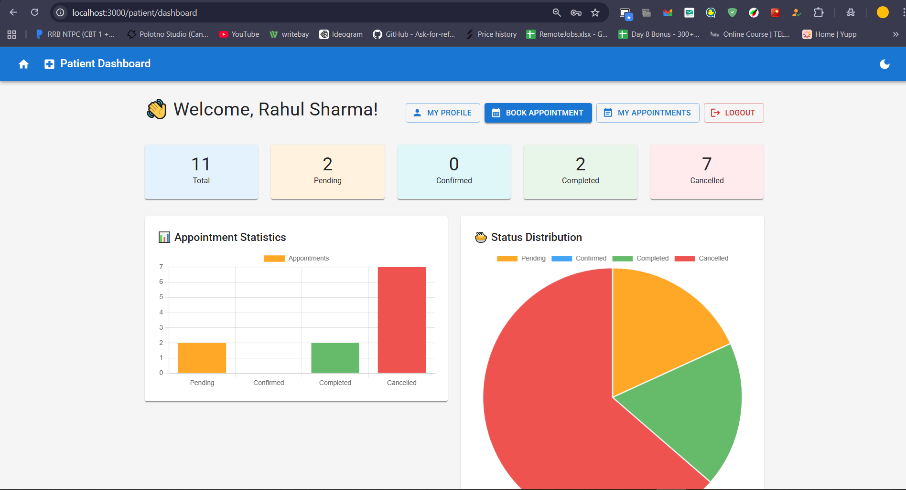
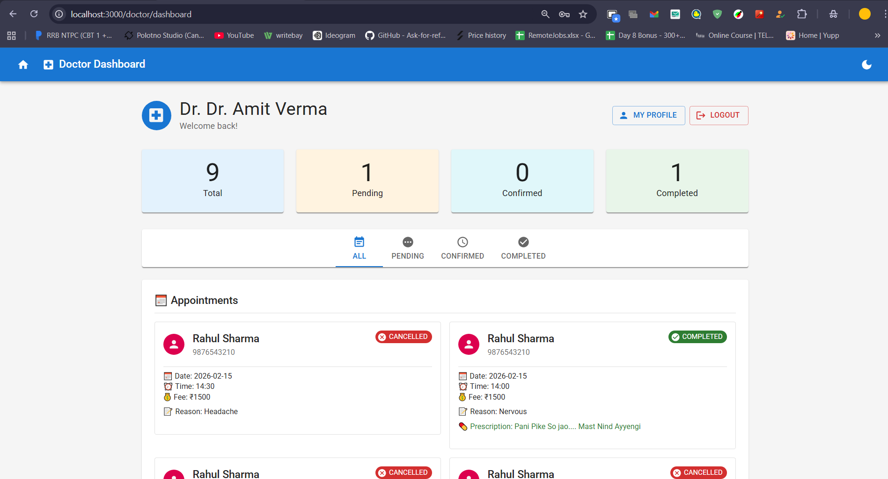
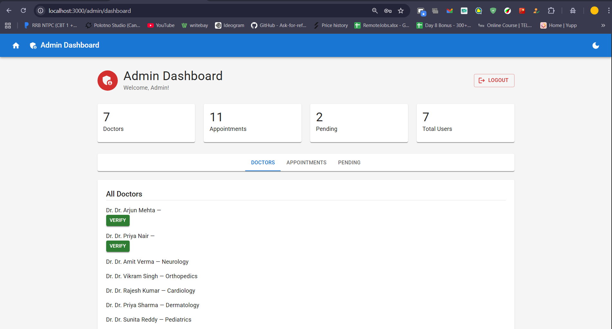

# 🏥 MediBook Pro

### Complete Healthcare Appointment Management System

**[Live Demo](#) • [Documentation](#) • [Report Bug](#) • [Request Feature](#)**

---

## 📋 Table of Contents

- [Overview](#-overview)
- [Key Features](#-key-features)
- [Tech Stack](#️-tech-stack)
- [System Architecture](#-system-architecture)
- [Getting Started](#-getting-started)
- [API Documentation](#-api-documentation)
- [Screenshots](#-screenshots)
- [Security](#-security)
- [Contributing](#-contributing)
- [License](#-license)
- [Contact](#-contact)

---

## 🌟 Overview

**MediBook Pro** is a production-ready, full-stack healthcare platform that streamlines the appointment booking process between patients and doctors. Built with modern technologies and following industry best practices, it offers a secure, scalable, and user-friendly solution for healthcare management.

### 🎯 Problem Statement

Traditional appointment booking systems are often fragmented, insecure, and lack real-time updates. MediBook Pro solves these challenges by providing:

- ✅ Centralized platform for patients and doctors
- ✅ Real-time appointment availability
- ✅ Secure payment processing
- ✅ Automated notifications and reminders
- ✅ Role-based access control

---

## ✨ Key Features

### 👤 Patient Portal

| Feature | Description |
|---------|-------------|
| 🔐 **Secure Authentication** | JWT-based auth with BCrypt password hashing |
| 🔍 **Smart Doctor Search** | Filter by specialization, location, ratings, availability |
| 📅 **Real-time Booking** | Interactive calendar with available time slots |
| 💳 **Integrated Payments** | Razorpay/Stripe integration for seamless transactions |
| 📧 **Auto Notifications** | Email/SMS confirmations and reminders |
| 📊 **Personal Dashboard** | View appointment history, prescriptions, reports |

### 👨‍⚕️ Doctor Portal

| Feature | Description |
|---------|-------------|
| ✅ **Appointment Management** | Accept/reject/reschedule appointments |
| 🕒 **Schedule Configuration** | Set availability, consultation hours, breaks |
| 👥 **Patient Records** | Access patient history and medical records |
| 💊 **Prescription System** | Digital prescription generation |
| 📈 **Analytics Dashboard** | Track earnings, patient count, ratings |

### 🔧 Admin Panel

| Feature | Description |
|---------|-------------|
| 👨‍⚕️ **Doctor Verification** | Approve/reject doctor registrations |
| 📊 **Platform Analytics** | System-wide metrics and reports |
| 👥 **User Management** | CRUD operations for all user types |
| ⚙️ **System Configuration** | Manage fees, time slots, categories |

---

## 🛠️ Tech Stack

### Backend
├── Core Framework
│ ├── Spring Boot 3.2.x
│ ├── Spring Security (JWT Auth)
│ └── Spring Data JPA
│
├── Database
│ ├── MySQL 8.0 (Primary)
│ └── Redis 7.0 (Caching & Sessions)
│
├── Additional Services
│ ├── AWS S3 (File Storage)
│ ├── AWS SES (Email Service)
│ ├── Twilio (SMS Notifications)
│ └── Razorpay/Stripe (Payments)
│
└── Build & Dependencies
└── Maven 3.8+

### Frontend
├── Core Library
│ └── React 18.x (Hooks, Context API)
│
├── UI Framework
│ └── Material-UI (MUI) 5.x
│
├── Routing & State
│ ├── React Router 6.x
│ └── Context API (State Management)
│
├── HTTP Client
│ └── Axios
│
└── Build Tool
└── Webpack (via Create React App)

### DevOps & Tools

- **Version Control:** Git & GitHub
- **API Testing:** Postman
- **Code Quality:** SonarLint, ESLint
- **Deployment:** Railway (Backend), Vercel (Frontend)

---

## 🏗️ System Architecture
┌─────────────────────────────────────────────────────────────┐
│ CLIENT LAYER │
│ ┌──────────────┐ ┌──────────────┐ ┌──────────────┐ │
│ │ Patient │ │ Doctor │ │ Admin │ │
│ │ Portal │ │ Portal │ │ Panel │ │
│ └──────────────┘ └──────────────┘ └──────────────┘ │
│ │ │ │ │
│ └──────────────────┴──────────────────┘ │
│ │ │
└───────────────────────────┼──────────────────────────────────┘
│
┌───────▼────────┐
│ API Gateway │
│ (Spring Boot) │
└───────┬────────┘
│
┌───────────────────┼───────────────────┐
│ │ │
┌───────▼────────┐ ┌───────▼────────┐ ┌──────▼──────┐
│ Authentication │ │ Business │ │ External │
│ & Security │ │ Logic │ │ Services │
│ (JWT/OAuth) │ │ (Services) │ │ (AWS/Twilio)│
└───────┬────────┘ └───────┬────────┘ └─────────────┘
│ │
└───────────┬───────┘
│
┌───────────▼───────────┐
│ Data Access Layer │
│ (JPA/Hibernate) │
└───────────┬───────────┘
│
┌───────────┴───────────┐
│ │
┌───────▼────────┐ ┌───────▼────────┐
│ MySQL Database│ │ Redis Cache │
│ (Persistent) │ │ (Sessions) │
└────────────────┘ └────────────────┘

---

## 🚀 Getting Started

### Prerequisites

Ensure you have the following installed:

- **Java 17+** ([Download](https://www.oracle.com/java/technologies/downloads/))
- **Node.js 16+** ([Download](https://nodejs.org/))
- **MySQL 8.0+** ([Download](https://dev.mysql.com/downloads/))
- **Maven 3.8+** ([Download](https://maven.apache.org/download.cgi))
- **Git** ([Download](https://git-scm.com/downloads))

### Installation

#### 1️⃣ Clone the Repository
git clone https://github.com/AmitIngAI/medibook-pro.git
cd medibook-pro

2️⃣ Database Setup
# Login to MySQL
mysql -u root -p

# Create database
CREATE DATABASE medibook;
USE medibook;

3️⃣ Backend Configuration
cd backend

# Copy example config
cp src/main/resources/application.properties.example src/main/resources/application.properties

# Edit configuration (use nano/vim/notepad)
nano src/main/resources/application.properties

Update these values:
spring.datasource.url=jdbc:mysql://localhost:3306/medibook
spring.datasource.username=YOUR_DB_USERNAME
spring.datasource.password=YOUR_DB_PASSWORD
jwt.secret=YOUR_256_BIT_SECRET_KEY

Run Backend:
mvn clean install
mvn spring-boot:run
✅ Backend runs at: http://localhost:8080

4️⃣ Frontend Configuration
cd ../frontend

# Copy example config
cp .env.example .env

# Edit .env
nano .env

Update:
REACT_APP_API_URL=http://localhost:8080/api

Run Frontend:
npm install
npm start
✅ Frontend runs at: http://localhost:3000

📚 API Documentation
Base URL : http://localhost:8080/api

Authentication Endpoints
Method	Endpoint	Description	Auth Required
POST	/auth/register/patient	Register new patient	❌
POST	/auth/register/doctor	Register new doctor	❌
POST	/auth/login	Login & get JWT token	❌
Example Request:
curl -X POST http://localhost:8080/api/auth/login \
  -H "Content-Type: application/json" \
  -d '{
    "email": "patient@example.com",
    "password": "password123"
  }'

Example Response:
{
  "token": "eyJhbGciOiJIUzI1NiIsInR5cCI6IkpXVCJ9...",
  "type": "Bearer",
  "id": 1,
  "email": "patient@example.com",
  "role": "PATIENT"
}

Appointment Endpoints
Method	Endpoint	Description	Auth Required
POST	/appointments/book	Book new appointment	✅ Patient
GET	/appointments/patient/{id}	Get patient appointments	✅ Patient
GET	/appointments/doctor/{id}	Get doctor appointments	✅ Doctor
PUT	/appointments/{id}/confirm	Confirm appointment	✅ Doctor
PUT	/appointments/{id}/cancel	Cancel appointment	✅ Both
View Full API Documentation →

## 📸 Screenshots

### 🏠 Landing Page

*Modern and responsive homepage with hero section and features*

### 🔐 Login Page

*Secure authentication with JWT token-based system*

### 👤 Patient Dashboard

*Real-time appointment tracking and personal health records*

### 👨‍⚕️ Doctor Dashboard

*Manage appointments, view patient details, and track consultations*

### 🔧 Admin Panel

*Complete system administration and analytics dashboard*

🔒 Security
This application implements industry-standard security practices:

Authentication & Authorization
✅ JWT Token-based Authentication
✅ BCrypt Password Hashing (10 rounds)
✅ Role-Based Access Control (RBAC)
✅ Refresh Token Mechanism
Data Protection
✅ SQL Injection Prevention (Parameterized Queries via JPA)
✅ XSS Protection (Input Sanitization)
✅ CSRF Protection (Token-based)
✅ CORS Configuration (Whitelist Origins)
Secure Headers
X-Content-Type-Options: nosniff
X-Frame-Options: DENY
X-XSS-Protection: 1; mode=block
Content-Security-Policy: default-src 'self'
Strict-Transport-Security: max-age=31536000

Environment Variables
Sensitive data is never hardcoded:
# Database credentials
DB_USERNAME=${env.DB_USERNAME}
DB_PASSWORD=${env.DB_PASSWORD}

# JWT secret
JWT_SECRET=${env.JWT_SECRET}

# Payment keys
STRIPE_SECRET=${env.STRIPE_SECRET}

🧪 Testing
Backend Tests
cd backend
mvn test
mvn verify

Frontend Tests
cd frontend
npm test
npm run test:coverage

📦 Deployment
Backend (Railway):
Push code to GitHub
Connect Railway to repository
Set environment variables
Deploy automatically

Frontend (Vercel):
npm run build
vercel --prod

🤝 Contributing
Contributions are welcome! Please follow these steps:

Fork the repository
1.Create feature branch (git checkout -b feature/AmazingFeature)
2.Commit changes (git commit -m 'Add AmazingFeature')
3.Push to branch (git push origin feature/AmazingFeature)
4.Open Pull Request

📄 License
This project is licensed under the MIT License - see the LICENSE file for details.

📞 Contact
Amit Ingale

📧 Email: amitgingale@gmail.com
💼 LinkedIn: linkedin.com/in/amitgingale07
🐙 GitHub: @AmitIngAI

⭐ Star this repository if you found it helpful!
Made with ❤️ by Amit Ingale
